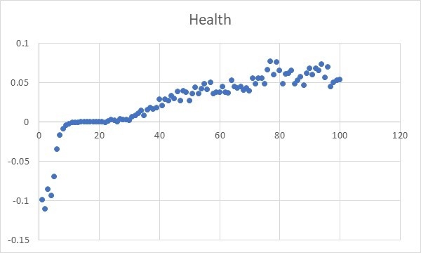
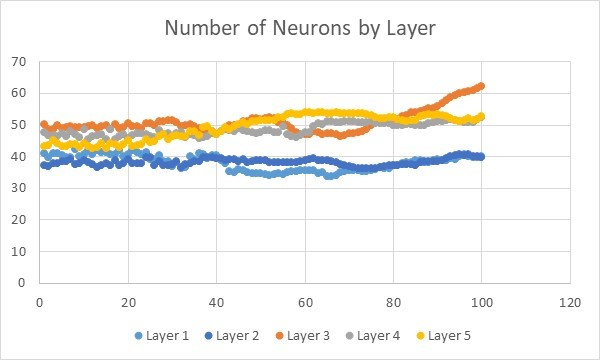
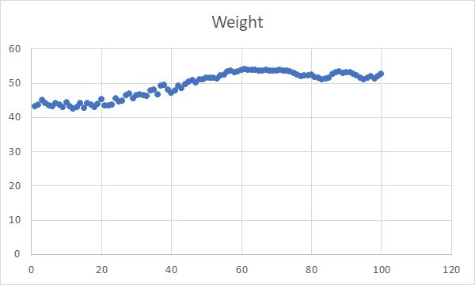
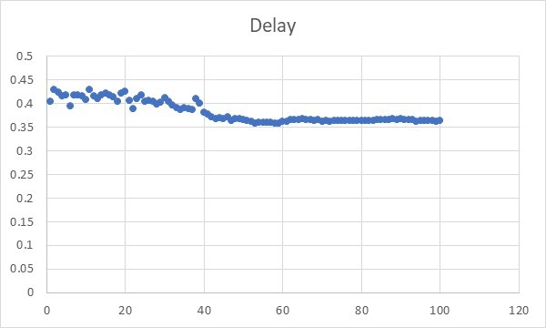
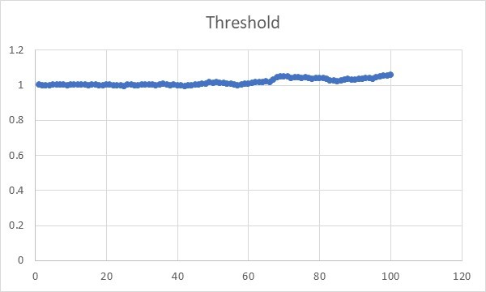
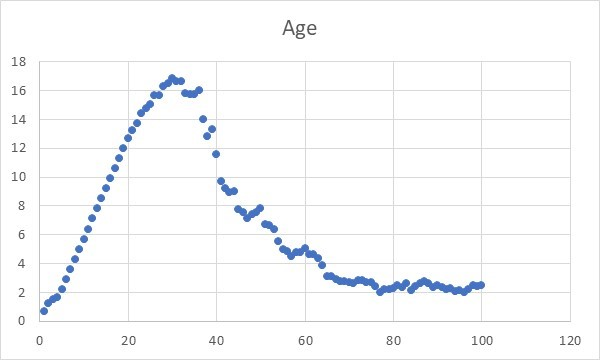
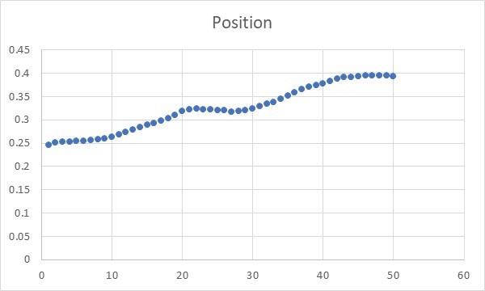

# Roundworm Neural Simulation
Evolve a colony of organisms (based on C. elegans) to adapt to various environmental stimuli, using an evolutionary algorithm and spike-timing dependent plasticity.

## Introduction
The purpose of this project was to evolve the brain structure of a roundworm, C. elegans, so that it could differentiate between various environmental stimuli and react accordingly. C. elegans was chosen as the inspiration for this project as it is the animal with the fewest neurons, yet still capable of a wide range of responses. 

## Method
Two basic algorithms form the foundation of this project. On the level of the individual organism, learning was accomplished via Spike-Timing Dependent Plasticity (STDP). The concept of STDP is simple: if an input spike to a neuron occurs immediately before the neuron’s output spike, then the connection between those two neurons is strengthened. On the other hand, if an input spike occurs after the neuron’s output spike, then the connection is weakened. The closer the time between input and output spike, the greater the strengthening/weakening of the connection. STDP was chosen over more complex machine learning algorithms as it is more biologically plausible. For example, a neural network involving backpropagation would be unlikely from a biological perspective, as synapses are one-directional. 

On the level of the entire colony of organisms, an evolutionary algorithm was applied to select the most suitable brain structure. The neurons were arranged in layers, with each neuron in the Nth layer connected to all neurons in the N-1th and N+1th layers. The number of neurons in each layer was subject to evolutionary pressure, as well as various constants involved in synapse weight, synapse delay, and neuron threshold.

## Results
Two sets of experiments were conducted. The first set monitored various key statistics as the colony evolved. 

 
Here, it can be seen that the health of the colony shows a clear increase over time, eventually reaching a plateau. This indicates the success of the evolutionary algorithm. Due to the random nature of the map, the organisms were not able to achieve optimal health. 

 
The results here are inconclusive. Most remained quite constant, though layers 2 and 4 seem to be slightly lower than layers 1, 3, and 5, which hints at an alternating layer structure. Again, however, the data is too noisy to indicate any real change. 
 

These three graphs deal with various parameters involved in the processing of neurons and synapses. None show a very clear change as generations evolved. Indeed, setting different initial values for these parameters also saw little change. 

 
This graph indicates the average age of organisms in the colony. Clearly, there is a sharp initial increase and a slower decline. Comparing this to the average health graph, it can be seen that the increasing phase corresponds to the sharp initial increase in colony health, i.e. the phase where fitter organisms are able to explore the environment and survive due to increased health. Then, as colony health increases at a slower rate and begins to plateau, all organisms achieve a fairly high health, and as a certain number are selected to die off regardless of health, the process is more or less random, leading to a decline in average age. 

The second set of experiments was designed to test if individual organisms were actually capable of learning. In the first set, only two environmental inputs were given: one which increased health, and one which decreased it. In this second set, a third input was added, which always had an equal value to the input beneficial to health, but had no effect on its own. If the organism was capable of learning, it could associate the third input with the first one, and in turn with a benefit in health. Therefore, it would move to areas with greater concentration of the third input, even after elimination of other inputs from the map. 

 
In this experiment, the colony was evolved for 50 generations on a map where the first and third inputs increased with x-axis position. Then, for the next 50 generations, the first input was eliminated, and the third input was increased with y-axis position. Evolution of the colony was switched off. 

From the graph, it can be seen that there is an overall increase in y-axis position, indicating that learning did occur, proving the success of the STDP method when combined with an evolutionary algorithm. 
